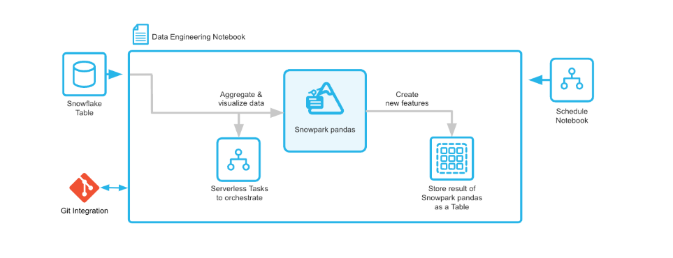

# Data Engineering Pipelines with Pandas on Snowflake

## Overview
Learn how to use pandas on Snowflake to create a customer profile based on the using the Snowflake Sample TPC-H dataset, save it into a Snowflake table and to create a serverless task to schedule the feature engineerin pipeline.

### Step By Step Guide
Environment set up, and set-by-step instructions, please refer to this guide [**QuickStart Guide**](https://quickstarts.snowflake.com/guide/data_engineering_pipelines_with_snowpark_pandas/index.html#0)
